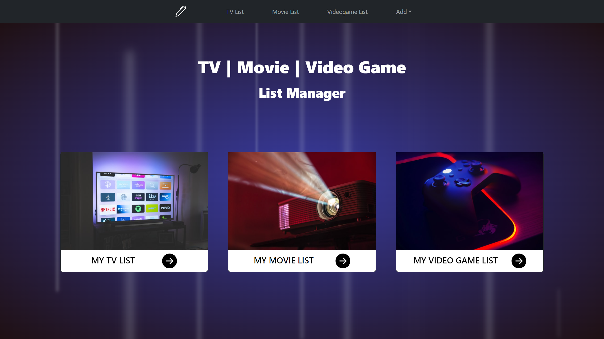

# Project Title

TV-Movie-Video-Game-App

## Demo link:

<!-- Access my site at [google.com](https://google.com) -->

## About The App

[TV-Movie-Video-Game-App] is a mobile responsive applcation tracking your tv/videogames/movies and keeping them in a table with specific categories. you can delete/add/edit each category and save it to local storage to persist.

## Screenshots

## Technologies

  &nbsp;
  &nbsp;
  &nbsp;
  &nbsp;

## Approach

Built with React and styled with Bootstrap/Vanilla CSS.
